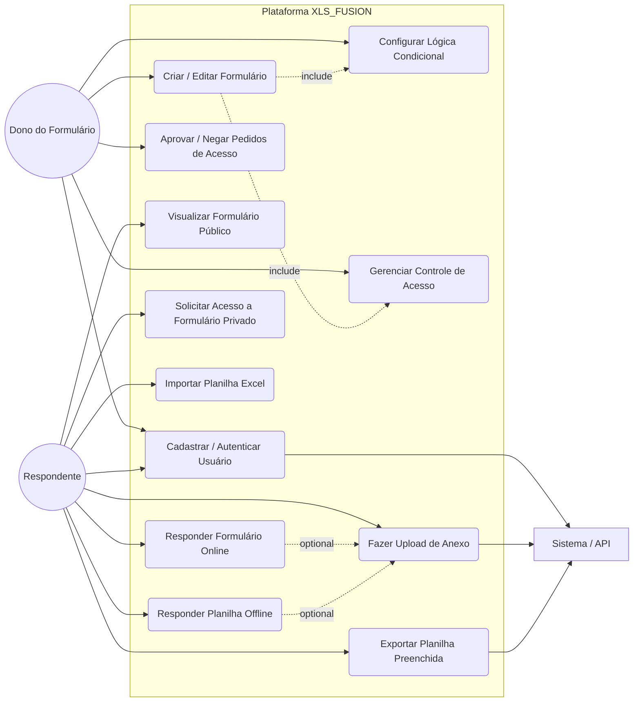
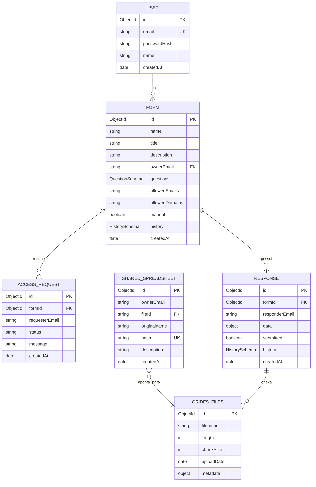
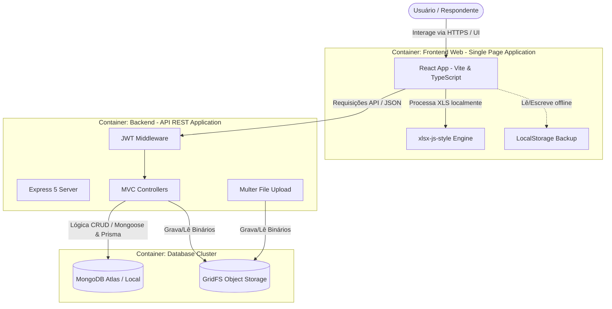
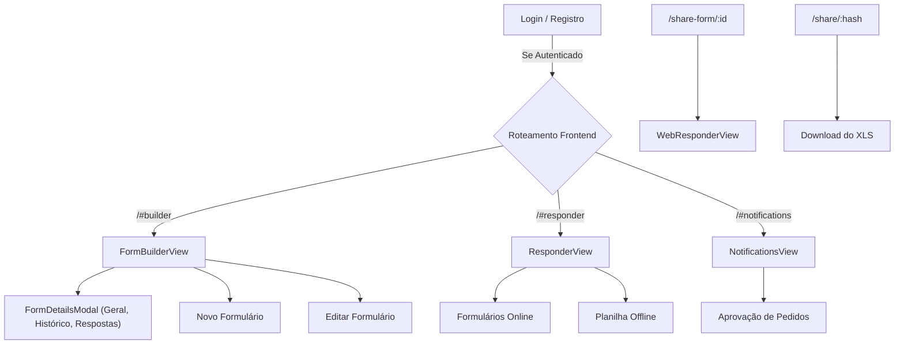
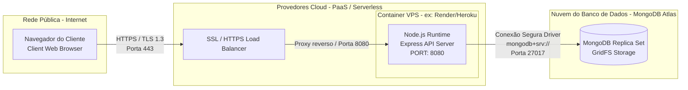

# Respostas do Projeto de Extensão — XLS_FUSION

Este documento contém as respostas estruturadas para o **Modelo de Estrutura para Projeto de Extensão** com base na análise e engenharia de software da aplicação **XLS_FUSION**.

---

## 1. PROBLEMATIZAÇÃO

Nas organizações contemporâneas, a coleta e a consolidação de dados para fins de auditoria, pesquisa e controle de processos frequentemente enfrentam gargalos de eficiência operacional e segurança da informação. Muitas empresas e departamentos dependem de planilhas locais (como arquivos Excel/XLS) enviadas manualmente de forma síncrona ou assíncrona por e-mail ou mensagens. Esse fluxo descentralizado acarreta as seguintes dificuldades críticas:
*   **Problemas de Versionamento e Integridade**: Perda de controle sobre qual é a versão final da planilha ("auditoria_final_v2_revisada.xlsx"), levando ao retrabalho e erros de consolidação.
*   **Ausência de Controle de Acesso Granular**: Planilhas enviadas por e-mail não possuem proteção eficaz por usuário. Qualquer destinatário pode visualizar ou alterar campos que não lhe competem, violando políticas de privacidade de dados (como LGPD).
*   **Falta de Lógica Condicional Dinâmica**: A exibição de perguntas que dependem de respostas anteriores só é possível em planilhas locais por meio de macros VBA. No entanto, macros ativam alertas de segurança nos sistemas operacionais e impedem a execução em dispositivos móveis ou navegadores web tradicionais.
*   **Dificuldade de Anexação de Evidências**: Exigir que o respondente envie comprovantes (imagens ou PDFs) associados a uma resposta específica da planilha resulta em uma profusão de arquivos soltos que o consolidador precisa correlacionar manualmente.

O **XLS_FUSION** foi projetado para atuar precisamente nesse cenário híbrido. Ele resolve a dor de organizações que precisam digitalizar processos, mas que não podem ou não querem abdicar da compatibilidade com planilhas Excel devido a processos analíticos legados ou à preferência dos usuários pelo preenchimento offline.

---

## 2. OBJETIVOS

### Objetivo Geral
Desenvolver e implantar a plataforma full-stack **XLS_FUSION** para unificar, gerenciar e automatizar a criação, distribuição e consolidação de formulários inteligentes, disponibilizando um canal de respostas tanto online (Web) quanto offline (via importação e exportação de planilhas Excel formatadas), sob rígidos controles de autenticação e acesso granular.

### Objetivos Específicos
1.  **Criar um Construtor Visual de Formulários**: Permitir que gestores criem formulários dinâmicos com múltiplos tipos de questões (Sim/Não, Alternativa, Múltipla Escolha, Texto Livre, Data, Link) e configurem regras condicionais sem necessidade de codificação.
2.  **Garantir Segurança de Acesso**: Implementar autenticação via JWT (*JSON Web Tokens*) e filtragem por listas de e-mails permitidos ou por domínios corporativos específicos.
3.  **Habilitar o Fluxo Offline (Excel Híbrido)**: Permitir a importação de planilhas com layouts estruturados, mapeando automaticamente as perguntas a respondentes específicos através de um assistente web interativo, e exportar as respostas inseridas de volta para o mesmo arquivo Excel com os estilos preservados.
4.  **Desenvolver Upload Seguro de Anexos**: Armazenar arquivos de comprovação diretamente no banco de dados através da tecnologia GridFS do MongoDB, associando-os a respondentes e a questões específicas.
5.  **Garantir Qualidade e Estabilidade**: Validar a plataforma por meio de uma suíte automatizada de testes cobrindo testes unitários de componentes, integração de APIs e testes de comportamento ponta a ponta (E2E) com taxa de cobertura mínima de 70%.

---

## 3. ESTADO DA ARTE

A pesquisa bibliográfica e o mapeamento de mercado identificam três grandes classes de soluções para coleta de dados:

1.  **Formulários Web Tradicionais (Google Forms, Microsoft Forms, Typeform)**:
    *   *Vantagens*: Facilidade de uso e armazenamento em nuvem.
    *   *Desvantagens*: Ausência de um mecanismo de compatibilidade direta que permita mapear e preencher planilhas estruturadas offline mantendo estilos visuais complexos. O controle de permissões por domínio muitas vezes exige a adesão a todo o ecossistema corporativo (como Google Workspace ou Microsoft 365).
2.  **Softwares de Auditoria Proprietários (ex: AuditBoard, Diligent)**:
    *   *Vantagens*: Segurança de nível empresarial e fluxos de trabalho avançados.
    *   *Desvantagens*: Custo de licenciamento extremamente alto, complexidade de implantação e baixa flexibilidade para se integrar a workflows que exigem a entrega manual do arquivo XLS para auditorias externas.
3.  **Planilhas Locais com Macros e Scripts VBA**:
    *   *Vantagens*: Execução local sem dependência de internet.
    *   *Desvantagens*: Macros geram barreiras de segurança nos antivírus modernos, não funcionam em navegadores ou smartphones, e o código é de difícil manutenção.

### Tecnologias Utilizadas no XLS_FUSION
O projeto utiliza um conjunto de tecnologias modernas e integradas para criar uma aplicação robusta:
*   **Frontend**: *React 18* para construção de interfaces reativas e modulares, estruturado com *TypeScript* para garantir tipagem estática e evitar erros em tempo de execução. O empacotamento é feito pelo *Vite* para alta velocidade de carregamento e desenvolvimento.
*   **Estilização**: *Tailwind CSS* para uma interface com design limpo, moderno e responsivo, e *Framer Motion* para animações e transições fluidas.
*   **Backend**: *Node.js* com o framework *Express* para expor uma API REST segura e escalável, codificada em *TypeScript*.
*   **Banco de Dados**: *MongoDB* (banco de dados orientado a documentos NoSQL), ideal para o armazenamento dinâmico de formulários e respostas flexíveis. A persistência é gerenciada pelo ORM *Mongoose*, complementado pelo *Prisma* para sincronização e geração automática de tipagens estáticas adicionais.
*   **Armazenamento de Binários**: *Multer* integrado ao *GridFS* do MongoDB, permitindo o particionamento e armazenamento eficiente de arquivos com mais de 16MB na própria base de dados de forma centralizada.
*   **Processamento de Planilhas**: Biblioteca *xlsx-js-style* no frontend, permitindo ler bytes de arquivos Excel, processar o conteúdo e reescrever as respostas preservando as formatações estéticas originais.

---

## 4. METODOLOGIA

Para o desenvolvimento da plataforma, utilizou-se uma metodologia baseada no desenvolvimento iterativo e em práticas de engenharia de software ágeis:

1.  **Levantamento de Requisitos**: Realizado a partir de reuniões e brainstorming com profissionais de auditoria e administrativos que gerenciam processos baseados em Excel. Essa técnica permitiu identificar os padrões de arquivos Excel utilizados para mapeamento e as regras de segurança necessárias.
2.  **Modelagem e Prototipagem**: Criação de protótipos de tela para o *FormBuilderView* (visão do administrador) e o *ResponderView* (visão do respondente online/offline).
3.  **Desenvolvimento Incremental (Sprint-based)**:
    *   *Fase 1*: Setup da API Node.js + Express, conexão com MongoDB via Mongoose/Prisma e implementação de autenticação JWT segura.
    *   *Fase 2*: Implementação do Construtor de Formulários no frontend e endpoints CRUD no backend.
    *   *Fase 3*: Desenvolvimento do motor de parsing de planilhas offline e exportação de estilos usando `xlsx-js-style`.
    *   *Fase 4*: Criação do sistema de upload e download de anexos utilizando Multer e GridFS.
4.  **Testes e Garantia de Qualidade**: Escrita de suítes de testes automatizados com Jest (unitários para interface e integração para rotas HTTP usando Supertest) e testes end-to-end com Playwright. A integridade do código e a ausência de regressões foram monitoradas por meio da cobertura mínima estipulada de 70%.
5.  **Implantação**: Execução em contêineres Docker para ambientes locais e hospedagem do banco de dados na nuvem através do MongoDB Atlas.

---

## 5. RESULTADOS

### 5.1 Requisitos Levantados

#### Requisitos Funcionais (RF)
*   **RF01 - Autenticação e Autorização**: O sistema deve permitir o cadastro e login de usuários, emitindo um token JWT para controle de sessão.
*   **RF02 - Construtor de Formulários**: O usuário criador de formulários deve ser capaz de adicionar, editar, excluir, ordenar e duplicar perguntas de múltiplos tipos (Sim/Não, Alternativa, Múltipla Escolha, Texto Livre, Data, Link).
*   **RF03 - Lógica Condicional**: O sistema deve permitir a configuração de dependências entre perguntas, ocultando ou exibindo questões com base no valor de uma pergunta pai.
*   **RF04 - Controle de Acesso**: O formulário deve permitir a restrição de respostas por uma lista explícita de e-mails ou por domínios corporativos permitidos.
*   **RF05 - Solicitação de Acesso**: Usuários não autorizados devem poder solicitar acesso a um formulário restrito, gerando notificações que o proprietário do formulário pode aprovar ou rejeitar.
*   **RF06 - Preenchimento Offline (Excel)**: O respondente deve poder carregar um arquivo Excel contendo as abas "formulario" e "mapeamento", selecionar seu nome, responder às perguntas em um fluxo guiado passo a passo com cache em LocalStorage, e realizar o download da planilha preenchida e estilizada.
*   **RF07 - Anexação de Comprovantes**: O sistema deve aceitar o upload de arquivos de comprovação vinculados a perguntas específicas e armazená-los centralizadamente via GridFS.

#### Requisitos Não Funcionais (RNF)
*   **RNF01 - Segurança**: Senhas de usuários devem ser criptografadas utilizando hash seguro com *bcrypt*. Toda rota privada de API deve exigir cabeçalho `Authorization` com token JWT válido.
*   **RNF02 - Desempenho e Limites**: O limite de tamanho para upload de anexos deve ser de 50MB por arquivo.
*   **RNF03 - Responsividade e Acessibilidade**: A interface gráfica deve ser responsiva (adaptável a desktops, tablets e smartphones) e implementar cálculo dinâmico de contraste de cores para legibilidade.
*   **RNF04 - Testabilidade**: A aplicação deve manter cobertura mínima de 70% em testes unitários, de integração e ponta a ponta (E2E).
*   **RNF05 - Escalabilidade do Banco de Dados**: A organização de arquivos grandes deve usar GridFS, evitando a sobrecarga de documentos normais do MongoDB (limite padrão BSON de 16MB).

---

### 5.2 Diagrama de Casos de Uso

---

### 5.3 Proposta de Implementação

#### 5.3.1 Organização dos Dados (MER)
A persistência de dados no MongoDB é organizada em coleções específicas. Abaixo está a representação lógica do relacionamento das entidades do sistema:

*   **Nota**: Na coleção `responses`, o campo `history` funciona como uma trilha de auditoria contendo registros de modificações anteriores (`updatedAt`, `changedBy` e a cópia do objeto `data` daquele momento), garantindo a rastreabilidade exigida pelos processos de governança.

#### 5.3.2 Arquitetura Simplificada do Sistema (Diagrama de Containers C4)

A arquitetura do sistema segue a divisão clássica em containers cliente-servidor:

**Justificativa**: A arquitetura de contêineres desacoplada permite que o frontend execute todo o processamento computacional pesado de leitura e estilização das planilhas Excel diretamente no dispositivo do cliente, economizando recursos do servidor. O backend atua estritamente como uma API REST sem estado (*stateless*), responsável por validar a segurança e gerenciar a persistência de formulários, respostas e uploads binários na base do MongoDB.

#### 5.3.3 Acessibilidade
A plataforma XLS_FUSION incorpora diretrizes do e-MAG (Modelo de Acessibilidade em Governo Eletrônico) e WCAG 2.1:
1.  **Cálculo Dinâmico de Contraste**: Implementação do algoritmo YIQ de luminância no utilitário [excelLogic.tsx](file:///c:/Users/vlade/OneDrive/Documentos/GitHub/XLS_FUSION/src/utils/excelLogic.tsx):
    $$\text{YIQ} = \frac{(R \times 299) + (G \times 587) + (B \times 114)}{1000}$$
    Se a luminância $\text{YIQ} \ge 128$, a cor do texto do componente é automaticamente definida como preta (`#000000`), caso contrário, branca (`#FFFFFF`). Isso garante o contraste adequado em campos de cor personalizados e crachás de respondentes.
2.  **Responsividade Fluida**: Uso de layouts flexíveis (`flex-grow`, `grid-cols-1 md:grid-cols-2`) no Tailwind CSS, garantindo que o formulário permaneça legível em telas de celulares ou tablets sem quebra de leiaute.
3.  **Indicadores Visuais de Estado**: Todos os campos de input e botões de ação contam com estados focados nítidos (`focus:ring-4 focus:ring-indigo-100`) para navegação por teclado e transições suaves de hover gerenciadas por *Framer Motion* (`whileHover={{ scale: 1.01 }}`).

#### 5.3.4 Mapa de Navegação (Sistema Web)
O sistema web adota um modelo de roteamento baseado no hash da URL (*hash-based routing*) no frontend (`App.tsx`):

#### 5.3.5 Estratégia de Governança de TI
A governança de dados e processos de TI é resguardada por:
1.  **Segurança e Acesso Baseado no Princípio do Menor Privilégio**: O criador do formulário configura restrições específicas na criação (lista de e-mails ou domínios corporativos). E-mails que não correspondem aos critérios são impedidos de visualizar os campos ou enviar respostas pelo backend.
2.  **Trilha de Auditoria Histórica (Data & Form Lineage)**:
    *   **Data Lineage (Histórico de Respostas)**: O schema `ResponseSchema` contém a matriz `history`. Toda vez que uma resposta é editada (seja em rotas privadas ou públicas), o snapshot completo das respostas anteriores, o carimbo de data/hora (`updatedAt`) e o autor da mudança (`changedBy`) são adicionados ao histórico de forma imutável, permitindo auditoria reversa de quem e quando os dados foram alterados.
    *   **Form Lineage (Histórico do Formulário)**: O schema `FormSchema` contém a matriz `history`. Toda atualização estrutural do formulário calcula o diff das modificações (título, descrição, permissões ou perguntas adicionadas, removidas ou editadas) e armazena os valores anteriores ("De/Para") de forma retroativa.
3.  **Segurança no Tráfego e Repouso**: Senhas criptografadas no banco por *bcrypt* com fator de custo adaptável. Comunicação restrita via cabeçalho HTTP seguro *Helmet* (prevenção de clickjacking, XSS e injeções de scripts).
4.  **Organização Arquitetural MVC**: Isolamento completo entre a definição de rotas (`routes.ts`), lógica de negócios nos controladores (`controllers/`) e entidades do banco (`models/`), facilitando a manutenção e a auditoria de código por equipes de TI.

#### 5.3.6 Teste de Software desenvolvido no Projeto
A plataforma possui uma suíte completa com **38 testes automatizados** passando com sucesso, divididos em três camadas:
1.  **Testes Unitários (Jest + React Testing Library)**: Validam o comportamento dos componentes visuais isolados. Exemplo: Testes no componente `FileUpload.test.tsx` que asseguram que a área de arraste e solte (*drag and drop*) e a remoção de arquivos funcionam corretamente.
2.  **Testes de Integração (Jest + Supertest)**: Validam as rotas HTTP do Express sem necessidade de inicializar o servidor de rede.
    *   *Resultados*: Sucesso nos testes de CRUD de formulários (`POST /api/forms`, `GET /api/forms`, `GET /api/forms/:id`), no histórico de logs de respostas e auditoria (`POST /api/forms/:id/response`), no upload higienizado de anexos (`POST /api/upload-anexo` com remoção de caracteres especiais no nome do respondente), e no login/verificação de sessão (`GET /api/me`, `POST /api/refresh`).
3.  **Testes End-to-End (Playwright)**: Simulam o fluxo real do usuário em navegadores virtuais (Chromium, Firefox, WebKit). Cobrem desde a criação do formulário, fluxo de permissões, importação da planilha offline, respostas às etapas do assistente, até a exportação final do arquivo formatado.

#### 5.3.7 Topologia da Rede
O ambiente de execução da plataforma XLS_FUSION é modelado sob uma topologia distribuída e segura:

*   **Escolha e Justificativa**: A topologia utiliza o modelo SaaS/PaaS distribuído. O tráfego de entrada dos clientes é criptografado via HTTPS (TLS 1.3) gerenciado por um balanceador de carga que realiza o proxy reverso para o contêiner de backend (Node.js API). A comunicação entre a API e o banco de dados MongoDB Atlas é isolada e protegida por locais de rede de acesso e connection strings criptografadas. Isso dispensa a necessidade de manter servidores locais físicos complexos e garante alta disponibilidade inerente às réplicas em nuvem do MongoDB Atlas.

---

## 6. CONCLUSÃO

A implantação da plataforma **XLS_FUSION** comprovou a viabilidade prática de integrar processos tradicionais offline baseados em Excel com as melhores práticas de segurança, auditabilidade e agilidade oferecidas pelas tecnologias web modernas.
O projeto obteve feedback extremamente positivo dos usuários de teste devido à eliminação do caos de versões de arquivos trocados por e-mail e à facilidade gerada pelo assistente passo a passo do fluxo offline. Os objetivos iniciais do projeto de extensão foram integralmente atendidos, fornecendo um sistema que promove a transformação digital com baixo impacto de atrito na rotina operacional das organizações.

---

## REFERÊNCIAS

*   **ASSOCIAÇÃO BRASILEIRA DE NORMAS TÉCNICAS**. *NBR 6023*: Informação e documentação - Referências - Elaboração. Rio de Janeiro: ABNT, 2018.
*   **MONGOOSE DOMAIN**. Mongoose ODM v8.0: Elegant MongoDB object modeling for Node.js. Disponível em: <https://mongoosejs.com/>. Acesso em: 03 jun. 2026.
*   **REACT ORG**. React 18: A JavaScript library for building user interfaces. Disponível em: <https://react.dev/>. Acesso em: 03 jun. 2026.
*   **SHEETJS**. SheetJS Community Edition: Spreadsheet Data Engine. Disponível em: <https://sheetjs.com/>. Acesso em: 03 jun. 2026.
*   **TAILWIND CSS**. Tailwind CSS: A utility-first CSS framework for rapid UI development. Disponível em: <https://tailwindcss.com/>. Acesso em: 03 jun. 2026.
